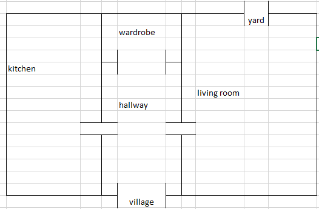
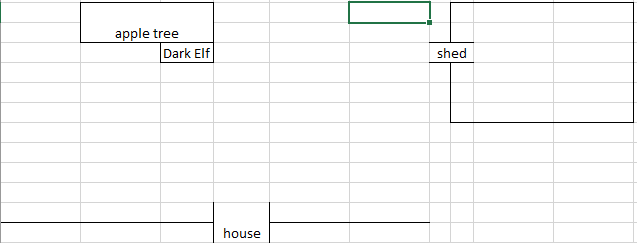
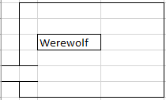

# Dark Of Darkness

# Source of conflict
- A sorcerer has unleashed a spell that has released monsters and has resulted in the sorcerers death.
- The monsters are rampant 

# Goal 
- You must enter the house of the sorcerer and end the spell

## end the spell
- use the wand and say the counter spell
- done in the dungeon over the body of the sorcerer with the spell book 

# sub Missions

## enter the shed
- use the enchanted sword as the key

## Get the elf to repair the wand
- give the elf the borken wand part
- ask the elf to repair the wand

## get the elf to enchant the sword
- give the potion and the sword to the elf
- ask the elf to enchant the sword

## load the gun
done anywhere

- silver bullet
- gun powder
- gun

## make silver bullet
made in the utility room

- silver coins
- propane torch
- bullet mold

## make potion
done in the kitchen with the pot

- empty bottle
- magic mushrooms
- blood of a werewolf
- vampire tooth

# initial items

- silver coins
- propane torch
- bullet mold
- gun powder
- gun

# enemies

## Vampire
- Defeated by wooded sword
- drops a vampire tooth
- allows you to take mirror

## troll
- defeated by reflecting light with mirror
- allows you to get spell book page

# Map

## Ground

### Wardrobe

#### INVISIBLE_CLOAK
- used to avoid detection
- single use

#### SWORD
- Is used to defeat monsters, and can be enchanted to unlock the shed as the key.
- It becomes the enchanted sword

#### MEDICINE
- Used to heal the character after battle
- It has limited use. (3 times)
- becomes and empty bottle

### Yard

### shed 

- is locked
- is unlocked by the enchanted sword

## upstairs

### trophy room

Has a gun mounted on the wall

### utility room

- has a propane torch
- a bullet mold

### office 

contains a safe 

### safe 

silver coins

## tower

- Werewolf that gives the player one chance to shoot with a silver bullet or run away
- if using the invisibility cloak it will allow sneak, however thw werewolf hears the played and eats them